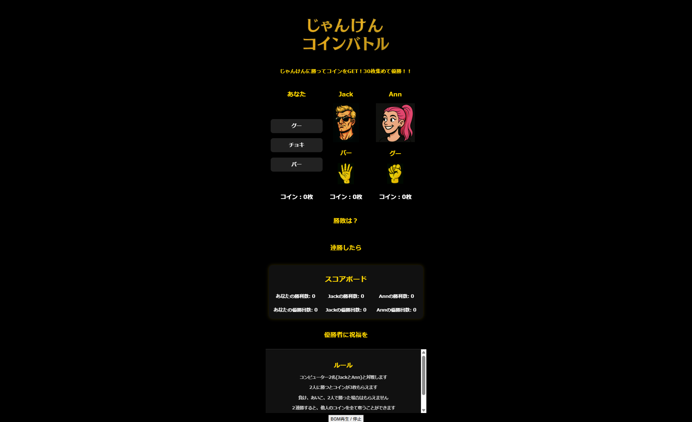

```markdown
# ①課題名
じゃんけんアプリ

## ②課題内容（どんな作品か）
-コンピューター2人とジャンケンで3人対戦
‐2人に勝った時だけコインが2枚もらえます
‐2連勝すると他の人のコインを没収総取りできます
‐30枚超えた人が優勝です 

## ③アプリのデプロイURL
https://aratabplp-boop.github.io/Janken-app/

## ④アプリのログイン用IDまたはPassword（ある場合）
- ID: なし
- PW: なし

## ⑤工夫した点・こだわった点
- 3人ジャンケン→27通りの結果
　最初は一つひとつの結果に対してif文を書く方向で作り始めたが
　途中でこれは破綻すると感じ、AIに相談。resultMapを作り
　そこから結果を取得し、一連の処理が走る方向に修正した
　ボタン押す→乱数発生（グーチョキーパー別）→RMから勝敗獲得
　→勝者がいればコインと勝利数加算→勝者表示→2連勝ならボーナス処理
　→勝敗表更新→優勝者がいれば優勝回数加算＋リセット
　（関数の一つひとつの記述は100％理解できているわけではないが
　　大きな設計の工夫と整理が重要ということは理解できた）
- 最初にゲーム部分のみを作成。CSSを書き始める前に、設計図として
　どのような要素を盛り込むべきかをAIに相談。21項目程度の観点出しがあり
　コードを書く前に、それぞれの観点を検討＆決定。
　そのためある程度統一した世界観＆物語性を表現できたと思う。


## ⑥難しかった点・次回トライしたいこと（又は機能）
- Result Map内にある結果は「グー」などのカタカナ表示なのですが
　それが関数で使えるとは感覚的に理解できず、AIが提案してくるコードを
　受け入れるのに時間がかかった。（伝わりますか？）（今も不思議）
- HZ（縦画面内表示）がうまくいかなかった。
‐ 2連勝総どりは結構ギャンブル感でるかな、と思ったが、それほどドキドキしない。
　もっとドキドキする＆シンプルなゲームを考えたい


